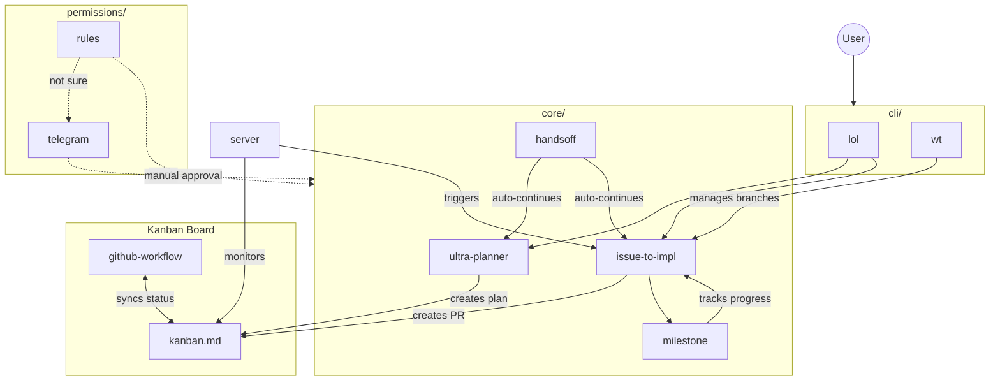

# 工作流图

本文件夹描述 Agentize 的主要功能，包括：

- `core/`：AI 智能体开发工作流，包括规划和实现。
  - `ultra-planner.md`：Ultra Planner 智能体，从高层次目标创建详细计划。
  - `mega-planner.md`：Mega Planner，采用 5 智能体双提案者辩论和外部 AI 综合。
  - `issue-to-impl.md`：Issue 到实现智能体，将计划项转化为代码。
  - `milestone.md`：milestone 工作流，用于通过进度追踪增量实现大型功能。
  - `handsoff.md`：stop hook，反馈进度以自动继续上述两个工作流。
- `permissions/`：权限管理工作流，包括请求、授予和撤销权限。
  - `rules.md`：基于规则的权限管理。
  - `telegram.md`：如果规则无法授予权限，发送消息到 Telegram 进行手动审批。
- `kanban.md`：使用 GitHub Project V2 的视图管理。
  - `github-workflow.md`：用于将看板与计划和实现进度同步的 GitHub Actions。
  - 由 `core/ultra-planner.md` 创建的每个计划都会在视图上显示为一个条目。
  - 由 `core/issue-to-impl.md` 从计划执行的每个 PR 都会在视图上显示为一个条目。
- `server.md`：运行在你本地机器上的 server，查看看板以自动执行计划。
- `cli/`：与上述功能交互的命令行接口。
  - `lol`：使用 Agentize 驱动的 SDK！
  - `wt`：Git worktree 封装

