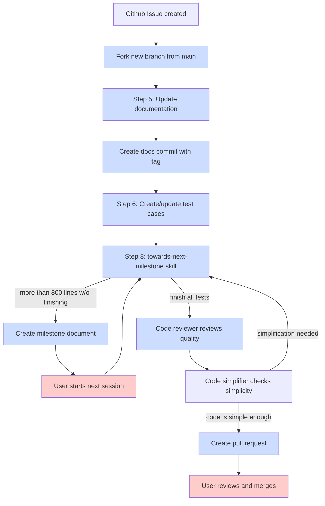

# Issue 到实现工作流

从 GitHub issue 到 pull request 的完整开发周期。



## 文档提交约定

工作流在步骤 5 创建一个专门的 `[docs]` 提交，与测试和实现提交分开：

1. **文档文件已更新** - 应用 "Documentation Planning" 部分中的变更
2. **遵循 diff 规范** - 如果计划包含 `--diff` 预览，直接应用它们
3. **创建独立提交** - `[docs]` 标签便于追踪和必要时回滚

这种分离提供了：
- 清晰的文档变更审计轨迹
- 能够独立于代码回滚文档
- 文档完整性的显式追踪

## 计划缓存

在步骤 4（读取实现计划）期间，工作流从 GitHub issue 提取 "Proposed Solution" 部分并缓存到本地：

**缓存位置：** `${AGENTIZE_HOME:-.}/.tmp/plan-of-issue-{N}.md`

该缓存计划实现了：
- handsoff 继续提示词期间的偏差感知
- 会话中断时更易恢复
- 跨多个继续周期的上下文保留

stop hook 读取该缓存计划（当可用时）并将其包含在 `/issue-to-impl` 继续提示词中。如果计划缓存缺失，继续提示词会优雅降级，不包含计划上下文。

## Dry-Run 模式

使用 `--dry-run` 预览实现工作流而不做任何更改：

```
/issue-to-impl 42 --dry-run
```

**行为：**
- 读取 issue 计划并验证其包含 "Proposed Solution" 部分
- 打印预期操作的预览：
  - 将创建的分支
  - 将修改/创建的文件
  - 每个步骤的预估代码行数
  - 测试策略摘要
- **不会**：创建分支、修改文件、创建提交、写入里程碑文件或创建 PR

**使用场景：** 在开始实现之前验证 issue 有完整的计划。
