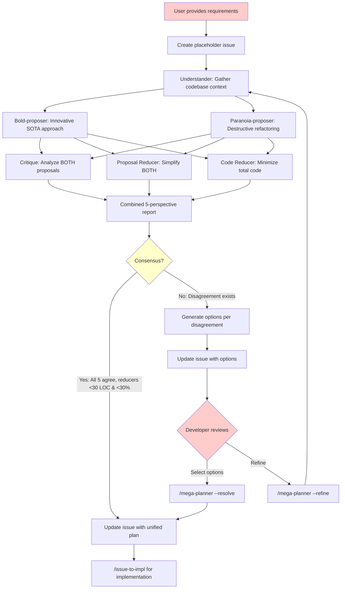

# Mega Planner 工作流

基于多智能体辩论的规划，采用双提案者（bold + paranoia）架构和外部 AI 综合，用于需要开发者仲裁的复杂功能。

## 概述

mega-planner 工作流在 ultra-planner 基础上扩展了 5 智能体双提案者架构，它能够：
1. 强制将智能体间的分歧暴露给开发者
2. 提供多种技术路线选项
3. 引入提案者之间的张力（建设性变更 vs 破坏性变更）
4. 引入精简者之间的张力（最小化变更范围 vs 最小化代码足迹）

## 工作流图



## 核心设计原则

### 强制分歧暴露

与自动解决分歧的 ultra-planner 不同，mega-planner 强制所有有争议的设计决策以分歧（Disagreement）部分的形式浮现，要求开发者进行选择。

### 共识标准

当以下所有条件都为真时达成**共识（CONSENSUS）**：
1. Bold 和 Paranoia 提出相同的大体方案
2. Critique 未发现关键阻塞点
3. 两个 Reducer 都建议同时实现两份提案，且对每份提案建议的变更 <30 行且 <总代码量的 30%

**分歧（DISAGREEMENT）** = 非共识。任何条件不满足都会触发分歧。

### 双提案者张力

| 智能体 | 方法 | 权衡 |
|-------|----------|-----------|
| **Bold Proposer** | 创新、增量式、在现有代码基础上构建 | 功能交付速度更快，可能增加复杂度 |
| **Paranoia Proposer** | 破坏性重构，推倒重建 | 减少技术债，可能破坏向后兼容性 |

### 双精简者张力

| 智能体 | 关注点 | 权衡 |
|-------|-------|-----------|
| **Proposal Reducer** | 最小化变更范围 | 更小的 PR，增量交付 |
| **Code Reducer** | 最小化总代码足迹 | 只要净代码减少，允许大变更 |

## 用法

### 创建计划

```
/mega-planner <feature_description>
```

与 ultra-planner 相同，但使用 5 智能体辩论并暴露分歧。

### 解决分歧

```
/mega-planner --resolve <issue_no> <your_selections>
```

快速解决路径，无需重新运行 5 智能体辩论。

**选择格式：**
- 选项代码：`1B`（分歧 1，选项 B）
- 多个选择：`1B,2A` 或 `1C 2B`

### 改进计划

```
/mega-planner --refine <issue_no> [instructions]
```

带着改进焦点重新运行 5 智能体辩论。

### 从 Issue 出发

```
/mega-planner --from-issue <issue_no>
```

为已有的功能请求 issue 做规划。

## 命令汇总

| 命令 | 描述 |
|---------|-------------|
| `/mega-planner <desc>` | 使用 5 智能体辩论创建计划 |
| `/mega-planner --resolve <N> <opts>` | 无需重新辩论即可解决分歧 |
| `/mega-planner --refine <N> [comments]` | 重新运行辩论以改进计划 |
| `/mega-planner --from-issue <N>` | 基于现有 issue 进行规划 |

## 与 Ultra-Planner 的对比

| 方面 | Ultra-Planner | Mega-Planner |
|--------|---------------|--------------|
| **智能体** | 3 个（Bold、Critique、Reducer） | 5 个（Bold、Paranoia、Critique、2 个 Reducer） |
| **提案者** | 1 个（仅 Bold） | 2 个（Bold + Paranoia） |
| **精简者** | 1 个（Proposal Reducer） | 2 个（Proposal + Code Reducer） |
| **分歧处理** | 自动解决 | 暴露给开发者 |
| **共识标准** | 隐式 | 显式（30 行且 30% 阈值） |
| **Resolve 模式** | 不可用 | `--resolve` 快速路径 |
