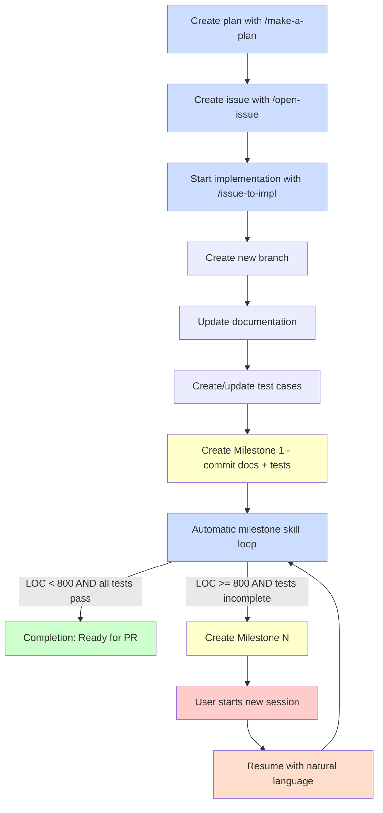

# Milestone 工作流

本文档描述 milestone 工作流，用于通过自动进度追踪和检查点创建来增量实现大型功能。

## 概述

milestone 工作流使 AI 智能体能够以可管理的增量实现大型功能（通常 > 800 LOC），创建追踪进度、测试状态和剩余工作的检查点文档。这使得开发可以跨越多个会话，同时保持清晰的上下文。

### 什么是 Milestone？

Milestone 是在实现大型功能过程中创建的开发检查点。每个 milestone：

- **追踪进度**：记录已实现的内容和剩余内容
- **监控测试**：显示哪些测试通过、哪些未通过
- **提供上下文**：支持从中断处恢复工作
- **提交进度**：使用 `--no-verify` 创建 git 提交，在测试不完整时绕过 pre-commit hook

### 何时使用 Milestone

在以下情况使用 milestone 工作流：

- **大型功能**：实现预估 > 800 LOC
- **多会话工作**：功能需要跨多个会话拆分工作
- **复杂实现**：逐步增量推进更有益
- **测试驱动开发**：测试已存在但实现正在进行中

**不要在以下情况使用 milestone：**
- 小型功能（< 200 LOC）——直接实现
- Bug 修复——使用常规提交
- 仅文档变更——无需增量追踪

---

## 工作流图



**图例：**
- **蓝色方框**：由 AI 智能体/skills/commands 执行的自动化步骤
- **黄色方框**：Milestone 创建点
- **绿色方框**：完成/成功状态
- **红色方框**：需要用户干预（开始新会话）

---

## Milestone 文档格式

Milestone 文档存储在 `.tmp/milestones/issue-{N}-milestone-{M}.md`，其中：
- `{N}` 是 issue 号
- `{M}` 是 milestone 号（1、2、3……）

### 文档结构

```markdown
# Milestone {M} for Issue #{N}

**Branch:** issue-{N}
**Created:** YYYY-MM-DD HH:MM:SS
**LOC Implemented:** ~XXX lines
**Test Status:** X/Y tests passed

## Work Remaining

[List of implementation steps not yet completed from the original plan]

- Step 3: Implement feature X (Estimated: 120 LOC)
  - File: path/to/file.py - Description
- Step 4: Add edge case handling (Estimated: 80 LOC)
  - File: path/to/other.py - Description

## Next File Changes (Estimated LOC for Next Milestone)

- `path/to/file1.py`: Description of changes needed (~50 LOC)
- `path/to/file2.py`: Description of changes needed (~120 LOC)
- `tests/test_feature.sh`: Additional test cases (~80 LOC)

**Total estimated for next milestone:** ~250 LOC

## Test Status

**Passed Tests:**
- test-agentize-modes.sh: All 6 tests passed
- test-c-sdk.sh: All tests passed

**Not Passed Tests:**
- test-new-feature.sh: 3 tests failing
  - Test case: Feature initialization
  - Test case: Edge case handling
  - Test case: Error recovery
```

---

## 命令与 Skills

### `/issue-to-impl` - 开始实现

编排从 issue 到完成的完整实现工作流。

**用法：**
```
/issue-to-impl [issue-number]
```

如果未提供 issue 号，将从对话上下文中提取。

**它做什么：**
1. 使用 `fork-dev-branch` skill 创建新的开发分支
2. 根据 issue 中的计划更新文档
3. 根据计划创建/更新测试用例
4. 自动创建 **Milestone 1**（提交文档 + 测试）
5. 启动自动 milestone skill 循环：
   - 分块实现代码（每块约 100-200 LOC）
   - 每块之后运行测试
   - 当 LOC ≥ 800 且未完成时停止（创建下一个 milestone）
   - 继续直到所有测试通过（完成）

**停止条件：**
- **Milestone 已创建**：智能体停止并告知用户在下一个会话中恢复
- **完成**：所有测试通过，可创建 PR

**示例：**
```
User: /issue-to-impl 42
Agent: Creating branch issue-42...
Agent: Updating documentation...
Agent: Creating test cases...
Agent: Creating Milestone 1 (0/8 tests pass)...
Agent: Implementing feature...
Agent: Milestone 2 created at 850 LOC (3/8 tests pass).
Agent: Resume with: "Continue from the latest milestone"
```

### 从 Milestone 恢复

创建 milestone 后，使用自然语言恢复实现。

**用法：**
```
User: Resume from the latest milestone
User: Continue implementation
User: Continue from .tmp/milestones/issue-42-milestone-2.md
```


**会发生什么：**
1. 验证你在开发分支上（issue-{N}-*）
2. 找到最新的 milestone 文件：`.tmp/milestones/issue-{N}-milestone-*.md`
3. 加载上下文：剩余工作、下一步文件变更、测试状态
4. 显示 milestone 摘要
5. 调用 milestone skill 继续实现
6. 创建下一个 milestone，或如果所有测试通过则完成

**示例：**
```
User: Continue from the latest milestone
Agent: Resuming from Milestone 2 for Issue #42
Agent: Test status: 3/8 tests passed
Agent: Estimated work remaining: ~350 LOC
Agent: Continuing implementation...
Agent: [implements next chunk]
Agent: Milestone 3 created at 780 LOC (6/8 tests pass).
Agent: Resume with: "Continue from the latest milestone"
```

### `milestone` Skill - 实现驱动器

驱动增量实现的核心 skill。由 `/issue-to-impl` 和自然语言恢复请求自动调用。

**它做什么：**
- 从 issue 或最新 milestone 文档读取计划
- 分块实现代码（每块 100-200 LOC）
- 使用 `git diff --stat` 追踪总 LOC 计数
- 每个实现块之后运行测试
- 解析测试结果以追踪通过/失败计数
- 当 LOC ≥ 800 且未完成时创建 milestone 文档
- 当所有测试通过时发出完成信号

---

## 示例演练

### 场景：实现一个大型功能（预估 1200 LOC）

**步骤 1：规划**
```
User: /make-a-plan
[Agent creates comprehensive plan with 1200 LOC estimate]

User: /open-issue
[Agent creates issue #42 with the plan]
```

**步骤 2：开始实现**
```
User: /issue-to-impl 42

Agent: Creating branch issue-42...
Agent: Updating documentation...
  - docs/typescript-support.md created
  - README.md updated
Agent: Creating test cases...
  - tests/test-typescript.sh created (8 test cases)
Agent: Creating Milestone 1...
  - Committed docs + tests (0/8 tests pass)
Agent: Implementing feature...
  [works for ~45 minutes, implementing code]
Agent: Milestone 2 created at 820 LOC (3/8 tests pass)
Agent: Resume with: "Continue from the latest milestone"
```

**步骤 3：恢复（下一个会话）**
```
User: Continue from the latest milestone

Agent: Resuming from Milestone 2 for Issue #42
Agent: Test status: 3/8 tests passed
Agent: Estimated work remaining: ~380 LOC
Agent: Continuing implementation...
  [works for ~30 minutes]
Agent: All tests passed (8/8)!
Agent: Implementation complete, ready for PR creation.
```

---

## 最佳实践

### 1. 始终从计划开始

在开始实现之前，使用 `/make-a-plan` 创建详细计划。计划应包括：
- 要修改/创建的具体文件
- 每个步骤的 LOC 预估
- 测试策略
- 按设计优先 TDD 顺序排列的实现步骤

### 2. 使用 `/issue-to-impl` 而非手动创建分支

不要手动创建分支并实现——使用 `/issue-to-impl`，它会：
- 正确创建分支
- 先设置文档和测试
- 自动创建第一个 milestone
- 按正确顺序开始实现

### 3. 每个 Milestone 之后恢复

创建 milestone 后，智能体会停止。要继续，使用自然语言：
```
User: Resume from the latest milestone
User: Continue implementation
```

这会加载上下文并从中断处继续。

### 4. Milestone 提交使用 `--no-verify`

Milestone 提交绕过 pre-commit hook，因为测试预期是不完整的。但是：
- 测试始终会运行以追踪进度
- Milestone 提交包含测试状态（例如 "3/8 tests pass"）
- 只有交付提交（所有测试通过）才会合并到 main
- 绝不在 main 分支上使用 milestone 提交

### 5. 监控测试进度

每个 milestone 显示测试状态：
```
**Test Status:** 3/8 tests passed

**Passed Tests:**
- Test 1: Basic initialization
- Test 2: Config loading
- Test 3: Error handling

**Not Passed Tests:**
- Test 4: Edge case handling
- Test 5: Performance requirements
- Test 6: Integration with existing code
- Test 7: Cleanup logic
- Test 8: Error recovery
```

这帮助你追踪朝向完成的进度。

### 6. 完成 = 所有测试通过

当所有测试通过时实现即完成。此时：
- 不创建 milestone
- 智能体发出完成信号
- **最终提交必须是交付提交**（不带 `[milestone]` 标签）：
  - 在 commit-msg skill 中使用 `purpose=delivery`
  - 不使用 `--no-verify` 标志（pre-commit hook 正常运行）
  - 只有交付提交应合并到 main
- 可以进行代码审查和 PR 创建

### 7. 审查与 PR 工作流

实现完成且所有测试通过后，遵循以下工作流：

**选项 A：手动工作流（推荐用于需要控制时）**
```
1. /code-review          # 审查变更，获取反馈
2. [修复发现的任何问题]
3. /open-pr              # 创建 pull request
```

**选项 B：便捷封装（推荐在实现完成后使用）**
```
/pull-request --open     # 一步完成审查 + 创建 PR
```

`/pull-request` 命令提供简化的工作流：
- **不带标志**：运行代码审查并停止，给出下一步指引
- **带 --open 标志**：运行代码审查，如果审查通过则立即创建 PR

---

## 故障排查

### "No milestone files found"

你正在尝试在没有 milestone 的分支上恢复。

**解决方案**：使用 `/issue-to-impl` 开始实现，它会创建第一个 milestone。

### "Not on development branch"

你在 `main` 或其他非开发分支上。

**解决方案**：切换到你的开发分支（issue-{N}）或使用 `/issue-to-impl` 开始。

### "Milestone file corrupted"

Milestone 文档格式不正确。

**解决方案**：检查 `.tmp/milestones/` 中的文件并修复格式，或删除它并用 `/issue-to-impl` 重新开始。

### 测试未运行

确保你的项目有 `make test` 目标，或在计划中指定测试命令。

**解决方案**：在 Makefile 中添加测试执行，或更新计划以指定测试的运行方式。

---

## 技术细节

### LOC 追踪机制

milestone skill 使用 `git diff --stat` 追踪 LOC：
- 在会话期间累计总 LOC 计数
- 每个实现块之后对照 800 LOC 阈值检查
- 当 LOC ≥ 800 且并非所有测试都通过时停止
- 创建包含当前状态的 milestone 文档

### 测试状态解析

运行测试后，milestone skill 解析输出以提取：
- 总测试数
- 通过测试数
- 失败测试数
- 各个测试用例名称和状态

这些信息包含在 milestone 文档和提交消息中。

### Milestone 文档版本化

Milestone 文档一旦创建即不可变：
- `issue-42-milestone-1.md` - 第一个 milestone
- `issue-42-milestone-2.md` - 第二个 milestone
- `issue-42-milestone-3.md` - 第三个 milestone
- 等等

每个文件代表一个时间点的快照。Git 历史展示实现的演进过程。
