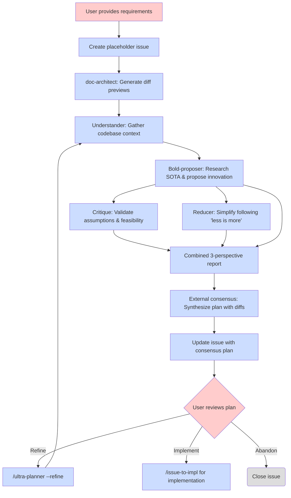

# Ultra Planner 工作流

基于多智能体辩论的规划工作流，用于复杂功能，支持基于 issue 的改进。

## 概述

ultra-planner 工作流通过多智能体辩论创建实现计划，并自动将其发布为 GitHub issue。这实现了早期可见性和基于 issue 的改进。

## 工作流图



## 关键特性

### 1. 基于复杂度的自动路由

Ultra-planner 根据预估的修改复杂度，自动在轻量级和完整辩论工作流之间路由。在 understander 收集代码库上下文后，它会估算修改的 LOC 并推荐路径：

- **Lite 路径**：当以下所有条件满足时使用单智能体规划器：
  - 所有知识都在仓库内（无需互联网研究）
  - 影响 < 5 个文件
  - 总计 < 150 LOC
- **Full 路径**：否则使用带网络研究的多智能体辩论

**带路由的工作流：**

```mermaid
graph TD
    A[User provides requirements] --> B[Create placeholder issue]
    B --> B2[doc-architect: Generate diff previews]
    B2 --> U[Understander: Gather context + estimate complexity]
    U --> R{Lite conditions met?}
    R -->|yes: repo-only, <5 files, <150 LOC| L[Planner-lite: Single-agent plan]
    R -->|no: needs research or complex| C[Bold-proposer: Research SOTA]
    C --> D[Critique + Reducer (parallel-only)]
    D --> F[Combined 3-perspective report]
    L --> H[Update issue with plan]
    F --> G[External consensus: Synthesize plan]
    G --> H
```

**优势：**
- 简单任务成本降低 55-70%
- 节省 4-8 分钟时间（lite 1-2 分钟 vs full 6-12 分钟）
- 无需用户干预

**覆盖标志：**
```
/ultra-planner --force-full <feature-description>
```
无论复杂度估算如何，强制使用完整多智能体辩论。

### 2. 自动 Issue 创建

Ultra-planner 在运行多智能体辩论工作流**之前**创建 GitHub issue：

- **先创建占位 issue** - 功能验证后立即建立 issue
- **以 issue 号命名的工件** - 所有规划文件从一开始就使用 `issue-{N}-` 前缀
- **计划前缀** - 标题采用 `[plan][tag]` 格式
- **共识后更新** - 同一 issue 会用最终计划更新（不会创建第二个 issue）
- **早期协作** - 利益相关者可以立即看到 issue 号和规划进度

**示例：**
```
Created placeholder issue: #42
Title: [plan][feat] Add user authentication
URL: https://github.com/user/repo/issues/42

Running multi-agent debate...
[Bold proposer, Critique, Reducer agents execute]

Issue #42 updated with consensus plan.

To refine: /ultra-planner --refine 42
To implement: /issue-to-impl 42
```

### 2a. 基于 Issue 的改进

改进模式（`/ultra-planner --refine`）支持迭代的计划改进：

- **获取 issue 正文** - 从 GitHub 拉取当前计划
- **运行完整辩论** - 与初始规划相同的三智能体工作流
- **接受改进焦点** - 可选的内联指令引导智能体
- **原子性更新 issue** - 仅在共识完成后替换正文

**示例（一般改进）：**
```
/ultra-planner --refine 42

Fetching issue #42...
Running debate on current plan...

[Agents analyze and improve plan - 5-10 minutes]

Issue #42 updated with refined plan.
Summary: Reduced LOC 280→250, improved security
```

**示例（定向改进）：**
```
/ultra-planner --refine 42 Focus on reducing complexity

Fetching issue #42...
Refinement focus: Focus on reducing complexity
Running debate on current plan...

[Agents focus on simplification - 5-10 minutes]

Issue #42 updated with refined plan.
Summary: Reduced LOC 280→150, removed OAuth2, simplified middleware
```

### 2b. 标签触发的自动改进

当 `agentize:refine` 标签被添加到计划 issue 时，server 可以自动触发改进。这实现了无需手动调用 `/ultra-planner --refine` 的改进请求。

**触发自动改进的方法：**
1. 确保 issue 的 Status 为 `Proposed`
2. 添加 `agentize:refine` 标签（通过 GitHub UI 或 `gh issue edit --add-label agentize:refine`）
3. server 的下一次轮询周期将：
   - 检测到改进候选
   - 将 Status 设为 `Refining`（并发控制）
   - 以 headless 方式运行 `/ultra-planner --refine`
   - 完成后：将 Status 重置为 `Proposed` 并移除标签

**要求：**
- issue 必须同时具有 `agentize:plan` 和 `agentize:refine` 标签
- Status 必须是 `Proposed`（而非 `Plan Accepted` 或 `In Progress`）
- server 必须正在运行（`lol serve`）

### 3. 带 Diff 预览的文档规划

外部共识过程必须显式识别文档影响，并在最终计划中生成 **Documentation Planning** 部分。这确保所有文档变更都被尽早识别并在实现过程中被追踪。

**标准格式：**
```markdown
## Documentation Planning

### High-level design docs (docs/)
- `docs/workflows/feature-name.md` — create new workflow documentation
- `docs/tutorial/XX-feature-name.md` — update tutorial with new feature

### Folder READMEs
- `src/feature/README.md` — update purpose and organization for new module

### Interface docs
- `src/api/endpoints.md` — update API interface documentation
```

**带 diff 预览的增强格式：**

当使用 `/doc-architect --diff` 时，Documentation Planning 部分包含展示建议变更的 markdown diff 预览：

```markdown
## Documentation Planning

### High-level design docs (docs/)
- [ ] `docs/workflows/feature-name.md` — update workflow diagram

` ` `diff
  ## Workflow Diagram

  ` ` `mermaid
  graph TD
      A[Start] --> B[Process]
+     B --> C[New Step]
+     C --> D[End]
-     B --> D[End]
  ` ` `
` ` `

### Folder READMEs
- [ ] `src/feature/README.md` — update purpose

` ` `diff
  # Feature Module
- Handles basic functionality.
+ Handles basic functionality with enhanced diff preview support.
` ` `
```

**diff 预览的优势：**
- 任务列表复选框支持在 GitHub UI 中追踪进度
- diff 块在实现前展示确切的建议变更
- 减少文档需求的歧义
- `/issue-to-impl` 步骤 5 可以直接应用 diff 规范

共识计划通过引用实际的 `docs/` 文件（例如 `docs/workflows/ultra-planner.md`、`docs/tutorial/02-issue-to-impl.md`）来引用命令接口，以确保准确性和落地性。

**Skill 集成：**
`/doc-architect` skill 生成此清单格式。使用 `/doc-architect --diff` 获取 diff 预览。

### 4. 审查与实现

审查计划 issue 后：

- **在 GitHub 上审查** - 在 issue 正文中检查计划细节
- **需要时改进** - 使用 `/ultra-planner --refine` 进行改进
- **准备好后实现** - 使用 `/issue-to-impl` 开始实现
- **时间灵活** - 准备好时实现，没有时间压力

## 运行时预期

### Ultra-Planner 初始运行

**使用自动路由**时，耗时取决于预估的复杂度：

#### Lite 路径（仅仓库内、<5 个文件、<150 LOC）

**时长：** 端到端 1-2 分钟

**分解：**
- Understander 智能体：1-2 分钟（代码库探索 + 复杂度估算）
- Planner-lite 智能体：30-60 秒（单智能体规划）
- 无共识步骤（单智能体，无需综合）
- 草稿 issue 创建：<10 秒

**成本：** 每次规划会话约 $0.30-0.80（2 个 Sonnet 智能体，无外部评审）

#### Full 路径（≥ 200 LOC）

**时长：** 端到端 6-12 分钟

**分解：**
- Understander 智能体：1-2 分钟（代码库探索 + 复杂度估算）
- Bold-proposer 智能体：2-3 分钟（研究 + 提案，带上下文）
- Critique + Reducer 智能体（仅并行）：2-3 分钟
- 外部共识评审：1-2 分钟
- 草稿 issue 创建：<10 秒

**成本：** 每次规划会话约 $2.50-6（1 个 Sonnet + 3 个 Opus 智能体 + 1 次外部评审）

### 改进运行（--refine 模式）

**时长：** 端到端 6-12 分钟（与初始运行相同）

**分解：**
- 与 ultra-planner 相同的智能体执行时间（包含 understander）
- issue 获取/更新：<5 秒

**成本：** 每次改进约 $2.50-6（与初始规划相同）

## 生命周期状态

1. **计划 Issue** - `[plan][tag]: Title`
   - 由 ultra-planner 自动创建
   - 对所有利益相关者可见
   - 可通过 `/ultra-planner --refine` 改进
   - 可通过 `/issue-to-impl` 实现

2. **已关闭/已放弃** - issue 在 GitHub 上被关闭
   - 计划已完成（关闭原因：`completed`）或未继续（关闭原因：`not planned`）
   - 已关闭的 issue 可在需要时重新打开
   - 使用 GitHub 的关闭原因区分已完成的工作与放弃的想法

## 命令汇总

### `/ultra-planner <feature-description>`

通过自动路由（lite 或 full 路径）创建初始计划，并自动创建计划 issue。

**用法：**
```
/ultra-planner Add user authentication with JWT and RBAC
```

**路由：** Understander 检查 lite 条件：
- Lite 路径（仅仓库内、<5 个文件、<150 LOC）：单智能体规划（1-2 分钟）
- Full 路径（其他情况）：带网络研究的多智能体辩论（6-12 分钟）

**输出：** 计划 issue URL 和改进/实现说明

### `/ultra-planner --dry-run <feature-description>`

运行完整的规划工作流，但跳过 GitHub issue 创建/更新。

**用法：**
```
/ultra-planner --dry-run Add user authentication with JWT tokens
```

**行为：**
- 运行 understander、bold-proposer、critique 和 reducer 智能体
- 将共识计划生成到 `.tmp/` 文件
- 打印 dry-run 摘要，展示将创建的 issue
- **不会**：创建占位 issue、更新 issue 正文或添加标签

**输出：** 包含计划 issue 标题、标签和 LOC 预估的 dry-run 摘要

**注意：** 由于多智能体辩论仍会执行，token 成本与常规运行相近。当你想在提交到 GitHub 之前审查计划时使用此模式。

### `/ultra-planner --force-full <feature-description>`

无论复杂度估算如何，强制使用完整多智能体辩论。

**用法：**
```
/ultra-planner --force-full Add simple helper function
```

**使用场景：** 当你希望对简单变更也进行彻底的多视角分析时。

**输出：** 计划 issue URL 和改进/实现说明

### `/ultra-planner --refine <issue-number> [refinement-instructions]`

通过多智能体辩论改进现有计划 issue 并更新 issue 正文。

**用法：**
```
/ultra-planner --refine 42
/ultra-planner --refine 42 Focus on reducing complexity
/ultra-planner --refine 42 Add more error handling and edge cases
```

**输出：** 更新后的 issue URL 和变更摘要

### `/ultra-planner --from-issue <issue-number>`

为现有 issue（通常是功能请求）创建计划，不创建新的占位 issue。

**用法：**
```
/ultra-planner --from-issue 42
```

**行为：**
1. 读取 issue #42 的标题和正文作为功能描述
2. 运行完整的多智能体辩论工作流（与初始规划相同）
3. 用共识计划更新 issue #42（在标题添加 `[plan]` 前缀）
4. 添加 `agentize:plan` 标签以标记为已规划

**使用场景：** server 驱动的功能请求规划。当 server 发现带 `agentize:dev-req` 标签的 issue 时，会调用 `/ultra-planner --from-issue <N>` 自动生成实现计划。

**输出：** 更新后的 issue URL 和计划摘要

### `/issue-to-impl <issue-number>`

实现计划 issue。

**用法：**
```
/issue-to-impl 42
```

**输出：** 实现进度和 milestone 提交

## CLI 实现

上述辩论流水线可通过 `lol plan` 命令使用：

```bash
lol plan "<feature-description>"
```

这不会改变上文记录的 `/ultra-planner` 命令接口。`lol plan` 使用的流水线细节见 `docs/cli/planner.md`。

## 与之前工作流的对比

| 方面 | 之前（v1） | 当前（v2） |
|--------|----------|-------------|
| **Issue 创建** | 用户批准之后 | 自动先创建占位 issue |
| **批准步骤** | issue 前的 CLI 提示 | issue 创建后审查 |
| **改进** | 不支持改进 | `--refine` 模式支持迭代 |
| **协作** | `.tmp` 中的计划文件 | 从一开始就是 GitHub issue |
| **可见性** | 批准前私有 | issue 立即公开 |
| **工作流** | 批准 → Issue → 实现 | Issue → 改进* → 实现 |

*改进是可选的，可以使用 `--refine` 多次进行
