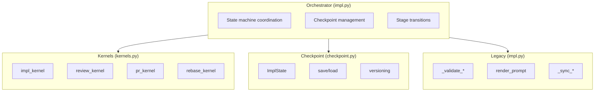
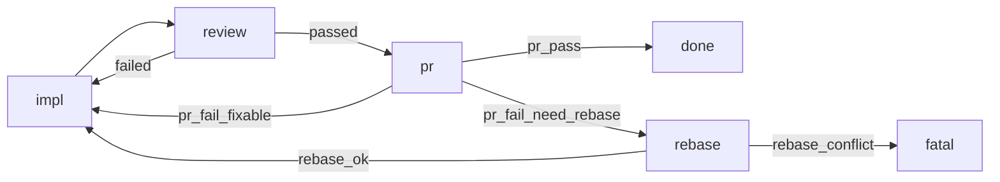

# `python/agentize/workflow/impl/` — `lol impl` Python 实现

本目录包含 `lol impl` 工作流的 Python 实现，用于将 GitHub issue 转化为实现 PR。

## 架构

该实现遵循模块化的基于内核（kernel）的架构：



### 模块组织

| 文件 | 用途 |
|------|---------|
| `impl.py` | 主编排器，包含状态机和向后兼容接口 |
| `kernels.py` | 各工作流阶段的内核函数（impl、review、pr、rebase） |
| `checkpoint.py` | 用于工作流恢复的可序列化状态管理 |
| `state.py` | FSM 阶段/事件契约和共享工作流上下文类型 |
| `transition.py` | 转移表和快速失败的转移校验器 |
| `orchestrator.py` | 使用阶段处理器和转移的扁平循环 FSM 执行器 |
| `__main__.py` | 带参数解析的 CLI 入口 |
| `__init__.py` | 公共导出 |
| `continue-prompt.md` | 实现迭代的提示词模板 |

### FSM 调度架构

生产执行由 `orchestrator.py` 中的 `run_fsm_orchestrator()` 驱动。
编排器读取当前阶段，从 `kernels.py` 中的 `KERNELS` 调用对应的内核，
接收带有事件的 `StageResult`，并通过 `transition.py` 中的 `TRANSITIONS`
表解析出下一个阶段。

来自 `checkpoint.py` 的 `ImplState` 被打包进 `WorkflowContext.data["impl_state"]`，
并作为权威的工作流状态。阶段内核直接修改 `ImplState`
以进行迭代跟踪、历史记录和检查点数据。编排器的
`pre_step_hook` 在每次阶段调度前保存检查点。

## 快速上手

### 基本用法

```python
from agentize.workflow.impl import run_impl_workflow

# 简单实现
run_impl_workflow(42)

# 带选项
run_impl_workflow(
    42,
    impl_model="codex:gpt-5.2-codex",
    max_iterations=15,
    yolo=True,
)
```

### 从检查点恢复

```python
from agentize.workflow.impl import run_impl_workflow

# 恢复中断的工作流
run_impl_workflow(42, resume=True)
```

### 使用单个内核

```python
from agentize.workflow.impl.checkpoint import create_initial_state
from agentize.workflow.impl.kernels import review_kernel
from agentize.workflow.api import Session

state = create_initial_state(42, Path("/path/to/worktree"))
session = Session(output_dir=state.worktree / ".tmp", prefix="impl-42")

passed, feedback, score = review_kernel(
    state,
    session,
    provider="codex",
    model="gpt-5",
)
```

## 工作流阶段

实现遵循以下阶段：

1. **Setup**：解析 worktree、同步分支、预取 issue
2. **Impl**（`impl_kernel`）：使用 AI 生成实现
3. **Review**（`review_kernel`）：质量校验（可选，实验性）
4. **PR**（`pr_kernel`）：创建带有明确结果事件的 pull request
5. **Rebase**（`rebase_kernel`）：从需要 rebase 的 PR 失败中恢复

### 状态机



## 检查点

每个阶段之后状态会自动保存到 `.tmp/impl-checkpoint.json`：

```python
from agentize.workflow.impl import ImplState, load_checkpoint

# 加载检查点
state = load_checkpoint(Path(".tmp/impl-checkpoint.json"))
print(f"Current stage: {state.current_stage}")
print(f"Iteration: {state.iteration}")
```

检查点格式包括：
- `version`：用于迁移的格式版本
- `timestamp`：检查点保存时间
- `state`：包含历史记录的完整 `ImplState`

## CLI 用法

```bash
# 基本用法
python -m agentize.workflow.impl 42

# 使用新标志
python -m agentize.workflow.impl 42 \
    --impl-model codex:gpt-5.2-codex \
    --max-iter 15 \
    --enable-review \
    --resume

# 已弃用的标志仍然有效
python -m agentize.workflow.impl 42 \
    --backend codex:gpt-5.2-codex \
    --max-iterations 10
```

## 向后兼容性

重构后的实现保持完全的向后兼容：

- `_validate_pr_title()` 保留在原位置以供导入
- `--backend` 和 `--max-iterations` CLI 参数仍可用（带弃用警告）
- 默认行为不变（review 阶段默认禁用）
- 启用 review 时，rebase/fatal 分支是显式且确定性的
- 所有现有测试无需修改即可通过

## 测试

```bash
# 运行所有 impl 相关测试
python -m pytest python/tests/test_impl_*.py -v

# 特定测试模块
python -m pytest python/tests/test_impl_checkpoint.py
python -m pytest python/tests/test_impl_kernels.py
python -m pytest python/tests/test_impl_review.py
python -m pytest python/tests/test_impl_pr_title.py
```

## 文档

- `impl.md` — 主要实现文档
- `kernels.md` — 内核函数签名和行为
- `checkpoint.md` — 状态格式和检查点 API
- `state.md` — FSM 阶段/事件契约和工作流上下文模型
- `transition.md` — 转移映射和快速失败校验规则
- `orchestrator.md` — FSM 执行循环和阶段日志契约
- `__init__.md` — 公共接口
- `__main__.md` — CLI 文档

## 扩展

### 添加新内核

1. 按照签名模式向 `kernels.py` 添加函数
2. 在 `kernels.md` 中编写文档
3. 在 `python/tests/test_impl_kernels.py` 中添加测试
4. 更新 `impl.py` 中的编排器以调用该内核

### 添加新阶段

1. 向 `state.py` 添加阶段/事件常量
2. 向 `transition.py` 添加转移边并更新 `required_pairs`
3. 在 `kernels.py` 中实现阶段内核并注册到 `KERNELS`
4. 如有需要，将阶段名称添加到 `ImplState.current_stage` 的 Literal 类型中
5. 更新检查点文档

## 未来工作

- 进一步测试后默认启用 review 阶段
- 将带格式修复重试的健壮运行器抽取到 `workflow.api`
- 添加更精细的 review 标准配置
- 支持多模型并行 review
